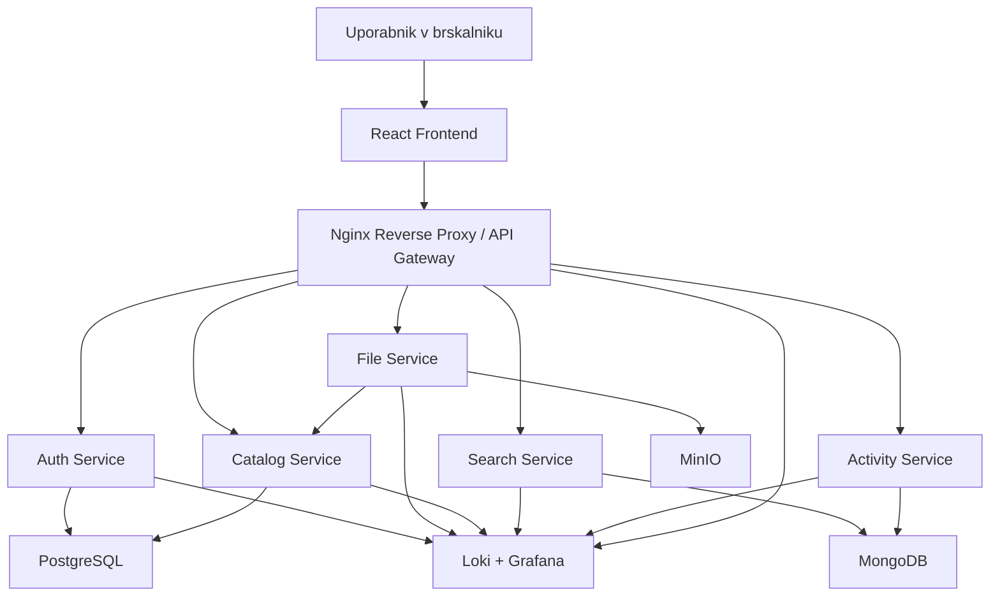

# StudyVault - skica arhitekture aplikacije

## Namen dokumenta

Ta dokument prikazuje skico arhitekture aplikacije **StudyVault** v dveh oblikah:

- najprej kot tekstovno skico od zgoraj navzdol
- nato še v obliki `mermaid` grafa

Za vsako stopnjo je zapisano:

- katera storitev je uporabljena
- zakaj je uporabljena
- kako deluje v celotni aplikaciji

---

## 1. Tekstovna skica arhitekture

```text
Uporabnik v brskalniku
    |
    v
React Frontend
    |
    v
Nginx Reverse Proxy / API Gateway
    |
    v
Auth Service
    |
    v
File Service
    |
    v
Catalog Service
    |
    v
Search Service
    |
    v
Activity Service
    |
    v
Podatkovni sloj:
PostgreSQL
MongoDB
MinIO
    |
    v
Opazovanje in belezenje:
Loki + Grafana
```

---

## 2. Mermaid graph notation



---

## 3. Razlaga posameznih stopenj

### 3.1 Uporabnik v brskalniku

**Uporabljena storitev:** spletni brskalnik uporabnika

**Zakaj:** ker uporabnik do aplikacije dostopa preko spletnega vmesnika brez potrebe po lokalni namestitvi.

**Kako:** uporabnik v brskalniku odpira aplikacijo, se prijavi, nalaga datoteke, išce gradivo in pregleduje svojo zgodovino aktivnosti.

---

### 3.2 React Frontend

**Uporabljena storitev:** `React`

**Zakaj:** React omogoca izdelavo enostavnega in odzivnega uporabniskega vmesnika, kar je primerno za projekt, kjer potrebujemo prijavo, seznam gradiv, iskalnik in nalaganje datotek.

**Kako:** frontend prikazuje uporabniske strani in posilja HTTP zahtevke na backend preko `Nginx` prehoda. Uporabnik tukaj upravlja datoteke, mape, oznake in iskanje.

---

### 3.3 Nginx Reverse Proxy / API Gateway

**Uporabljena storitev:** `Nginx`

**Zakaj:** potrebujemo eno vstopno tocko v sistem, ki zna usmerjati promet na pravilne mikrostoritve in hkrati servirati frontend.

**Kako:** `Nginx` sprejme vse zahteve od frontenda in jih glede na pot preusmeri naprej:

- `/` na frontend
- `/api/auth` na `Auth Service`
- `/api/files` na `File Service`
- `/api/catalog` na `Catalog Service`
- `/api/search` na `Search Service`
- `/api/activity` na `Activity Service`

---

### 3.4 Auth Service

**Uporabljena storitev:** `Auth Service`

**Zakaj:** prijava in registracija uporabnikov morata biti loceni od ostalih funkcionalnosti, saj gre za poseben varnostni del sistema.

**Kako:** storitev skrbi za registracijo, prijavo, preverjanje uporabnika in izdajo `JWT` zetonov. Druge storitve potem na podlagi tega zetona preverijo, ali ima uporabnik pravico dostopa.

---

### 3.5 File Service

**Uporabljena storitev:** `File Service`

**Zakaj:** dejansko nalaganje in prenasanje datotek ima drugacno logiko kot delo z metapodatki, zato je smiselno ta del lociti.

**Kako:** `File Service` sprejme datoteko, preveri velikost in tip, jo shrani v `MinIO` ter pripravi osnovne informacije o datoteki. Nato posreduje metapodatke `Catalog Service`, da se datoteka pravilno evidentira v sistemu.

---

### 3.6 Catalog Service

**Uporabljena storitev:** `Catalog Service`

**Zakaj:** aplikacija potrebuje centralno mesto za vse strukturirane podatke o gradivih, mapah, oznakah in deljenju vsebin.

**Kako:** storitev hrani metapodatke o datotekah, lastnistvu, mapah, oznakah in povezavah med njimi. Ko uporabnik preimenuje datoteko, jo prestavi v mapo ali doda oznako, spremembo obdela ravno ta storitev.

---

### 3.7 Search Service

**Uporabljena storitev:** `Search Service`

**Zakaj:** iskanje je obicajno hitrejse in bolj pregledno, ce je loceno od osnovnega transakcijskega dela aplikacije.

**Kako:** `Search Service` prejme indeksirane podatke o datotekah in omogoca iskanje po nazivu, oznakah, tipu datoteke ali drugih filtrih. Frontend pri iskanju klice to storitev namesto neposrednega branja iz glavne relacijske baze.

---

### 3.8 Activity Service

**Uporabljena storitev:** `Activity Service`

**Zakaj:** belezenje aktivnosti uporabnikov je koristno za pregled nedavnih dejanj in za enostaven audit sistema.

**Kako:** storitev zapisuje dogodke, kot so prijava, nalaganje datoteke, brisanje, prenos ali sprememba metapodatkov. Te podatke nato lahko frontend prikaze kot "recent activity".

---

### 3.9 PostgreSQL

**Uporabljena storitev:** `PostgreSQL`

**Zakaj:** relacijska baza je najboljsa izbira za strukturirane in med seboj povezane podatke, kot so uporabniki, datoteke, mape, oznake in pravice dostopa.

**Kako:** `Auth Service` in `Catalog Service` uporabljata `PostgreSQL` za shranjevanje transakcijskih podatkov. Tako ostanejo odnosi med entitetami urejeni in zanesljivi.

---

### 3.10 MongoDB

**Uporabljena storitev:** `MongoDB`

**Zakaj:** za iskalne dokumente in dnevnik aktivnosti je primerna NoSQL baza, ker omogoca bolj fleksibilno strukturo podatkov.

**Kako:** `Search Service` uporablja `MongoDB` za iskalni indeks, `Activity Service` pa za zbirko dogodkov. To omogoca hitro poizvedovanje po dinamicnih zapisih.

---

### 3.11 MinIO

**Uporabljena storitev:** `MinIO`

**Zakaj:** aplikacija potrebuje prostor za shranjevanje dejanske vsebine datotek, ne samo njihovih opisov. Za to je objektna shramba primernejsa od klasicne relacijske baze.

**Kako:** `File Service` v `MinIO` shrani binarne datoteke, na primer PDF-je, slike in zapiske. V bazi se hranijo samo reference in metapodatki, ne pa cela vsebina datotek.

---

### 3.12 Loki + Grafana

**Uporabljena storitev:** `Loki + Grafana`

**Zakaj:** pri mikrostoritveni arhitekturi je pomembno centralno spremljanje logov, saj napake in dogodki nastajajo v vec razlicnih storitvah.

**Kako:** vse storitve in `Nginx` zapisujejo loge, ki se zbirajo v `Loki`, nato pa jih v `Grafani` pregledamo skozi nadzorne plosce. To pomaga pri odpravljanju napak in demonstraciji delovanja sistema.

---

## 4. Povzetek arhitekturne logike

Arhitektura aplikacije `StudyVault` sledi logiki, da ima vsak vecji del sistema svojo jasno odgovornost. `React` skrbi za uporabniski vmesnik, `Nginx` za usmerjanje prometa, mikrostoritve za poslovno logiko, `PostgreSQL` in `MongoDB` za podatke, `MinIO` za datoteke, `Loki + Grafana` pa za spremljanje sistema. Tak razrez je dovolj kompleksen za predmet NUKS, hkrati pa je se vedno realno izvedljiv v okviru studentskega projekta.
