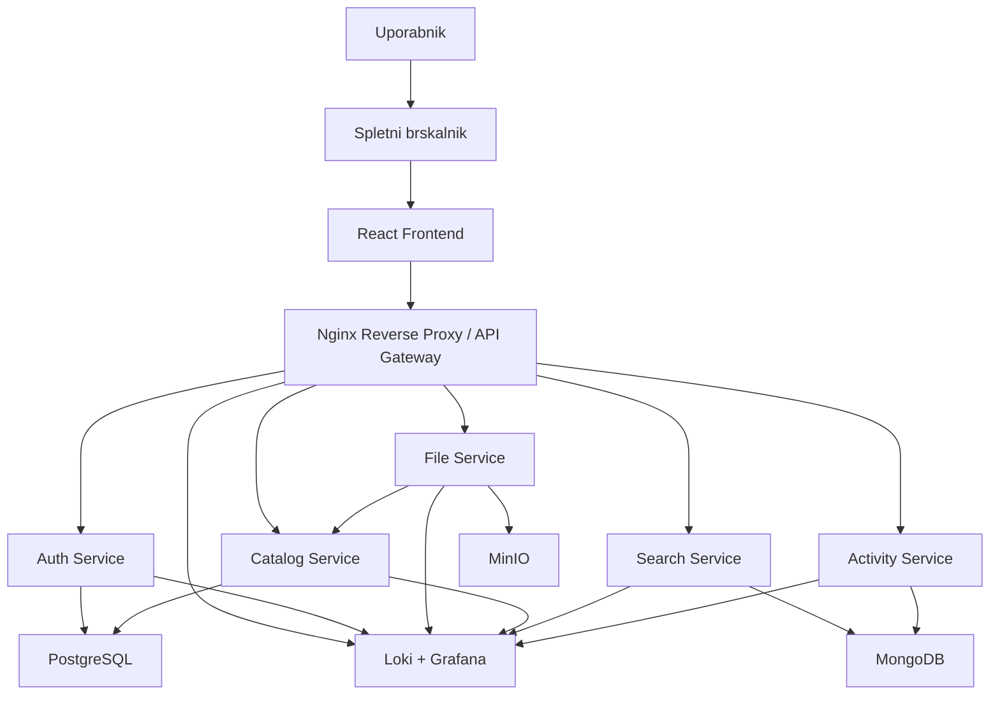

# StudyVault - formalna skica arhitekture aplikacije

## Uvod

V nadaljevanju je predstavljena skica arhitekture aplikacije **StudyVault**. Prikaz je pripravljen v dveh oblikah:

- kot tekstovna skica od zgoraj navzdol
- kot diagram v obliki `mermaid graph notation`

Pri vsaki arhitekturni stopnji je dodatno pojasnjeno:

- katera storitev je uporabljena
- zakaj je uporabljena
- kako sodeluje z ostalimi deli sistema

Cilj taksne arhitekture je doseci jasno razdelitev odgovornosti, pregledno komunikacijo med komponentami in realno izvedljivost v okviru projektne naloge pri predmetu NUKS.

---

## 1. Tekstovna skica arhitekture

```text
Uporabnik
    |
    v
Spletni brskalnik
    |
    v
React Frontend
    |
    v
Nginx Reverse Proxy / API Gateway
    |
    +------------------------------+
    |              |               |
    v              v               v
Auth Service   File Service   Catalog Service
                    |               |
                    v               v
                  MinIO        PostgreSQL
                    |
                    v
              Search Service
                    |
                    v
                 MongoDB
                    |
                    v
              Activity Service
                    |
                    v
                 MongoDB
                    |
                    v
             Loki + Grafana
```

---

## 2. Mermaid graph notation



---

## 3. Opis arhitekturnih stopenj

### 3.1 Uporabnik in spletni brskalnik

**Uporabljena storitev:** spletni brskalnik

**Zakaj:** spletni brskalnik predstavlja najpreprostejsi in najbolj dostopen nacin uporabe aplikacije, saj uporabnik ne potrebuje posebne namestitve programske opreme.

**Kako:** uporabnik preko brskalnika dostopa do uporabniskega vmesnika, se prijavi v sistem, nalaga datoteke, pregleduje svoja gradiva ter izvaja iskanje po vsebini in metapodatkih.

---

### 3.2 React Frontend

**Uporabljena storitev:** `React`

**Zakaj:** React je primeren za izdelavo sodobnega in odzivnega spletnega vmesnika, kjer je potrebno prikazati vec povezanih pogledov, kot so prijava, pregled datotek, nalaganje gradiv, iskalnik in zgodovina aktivnosti.

**Kako:** frontend skrbi za predstavitveni sloj aplikacije. Uporabniku prikazuje obrazce, sezname in rezultate iskanja, medtem ko se vsa poslovna logika izvaja v ozadju preko klicev na backend storitve skozi `Nginx`.

---

### 3.3 Nginx Reverse Proxy / API Gateway

**Uporabljena storitev:** `Nginx`

**Zakaj:** v mikrostoritveni arhitekturi je smiselno imeti enotno vstopno tocko, ki sprejema promet od odjemalca in ga usmerja do ustrezne storitve.

**Kako:** `Nginx` sprejema vse HTTP zahtevke iz frontenda in jih na osnovi poti preusmerja:

- `/` do frontenda
- `/api/auth` do `Auth Service`
- `/api/files` do `File Service`
- `/api/catalog` do `Catalog Service`
- `/api/search` do `Search Service`
- `/api/activity` do `Activity Service`

Na ta nacin je dostop do storitev poenoten, sistem pa ostaja bolj pregleden in lazje upravljiv.

---

### 3.4 Auth Service

**Uporabljena storitev:** `Auth Service`

**Zakaj:** avtentikacija in avtorizacija sta varnostno obcutljiv del sistema, zato morata biti logicno loceni od ostalih funkcionalnosti.

**Kako:** `Auth Service` omogoca registracijo uporabnikov, prijavo, preverjanje identitete in izdajo `JWT` zetonov. Na podlagi teh zetonov ostale storitve preverjajo, ali je posamezen uporabnik upravicen do dolocene operacije.

---

### 3.5 File Service

**Uporabljena storitev:** `File Service`

**Zakaj:** delo z dejansko vsebino datotek zahteva drugacen nacin obdelave kot delo s strukturiranimi metapodatki, zato je ta funkcionalnost locena v samostojno storitev.

**Kako:** `File Service` sprejme nalozeno datoteko, preveri njeno velikost in tip, nato pa binarno vsebino shrani v `MinIO`. Po uspesnem shranjevanju posreduje osnovne informacije o datoteki storitvi `Catalog Service`, kjer se zabelezijo metapodatki.

---

### 3.6 Catalog Service

**Uporabljena storitev:** `Catalog Service`

**Zakaj:** aplikacija potrebuje osrednjo storitev za upravljanje vseh strukturiranih podatkov o gradivih, mapah, oznakah, lastnistvu in morebitnem deljenju vsebin.

**Kako:** `Catalog Service` obdeluje operacije nad metapodatki datotek. Skrbi za ustvarjanje in posodabljanje zapisov o gradivih, za povezovanje datotek z mapami in oznakami ter za hranjenje informacij o lastnistvu in dostopu.

---

### 3.7 Search Service

**Uporabljena storitev:** `Search Service`

**Zakaj:** iskanje po gradivih je smiselno lociti od osnovnega CRUD dela aplikacije, saj gre za drugacen tip poizvedb in optimizacije.

**Kako:** `Search Service` pripravlja in uporablja iskalni indeks, s katerim omogoca hitro iskanje po naslovu, oznakah, tipu datoteke in drugih atributih. Frontend rezultate iskanja pridobi preko te storitve, namesto da bi neposredno obremenjeval glavno relacijsko bazo.

---

### 3.8 Activity Service

**Uporabljena storitev:** `Activity Service`

**Zakaj:** aplikacija potrebuje pregled nad pomembnimi dejanji uporabnikov, tako zaradi uporabniske funkcionalnosti kot tudi zaradi osnovnega audita sistema.

**Kako:** `Activity Service` hrani dogodke, kot so prijava, nalaganje datotek, brisanje, prenos in spremembe metapodatkov. Ti zapisi se lahko uporabijo za prikaz nedavnih aktivnosti v uporabniskem vmesniku.

---

### 3.9 PostgreSQL

**Uporabljena storitev:** `PostgreSQL`

**Zakaj:** relacijska baza je primerna za urejene, med seboj povezane in transakcijsko pomembne podatke.

**Kako:** v `PostgreSQL` se shranjujejo uporabniki, podatki o datotekah, mape, oznake in razmerja med njimi. To bazo uporabljata predvsem `Auth Service` in `Catalog Service`.

---

### 3.10 MongoDB

**Uporabljena storitev:** `MongoDB`

**Zakaj:** za dnevnike aktivnosti in iskalne dokumente je primerna bolj fleksibilna NoSQL baza, kjer ni nujna stroga relacijska struktura.

**Kako:** `Search Service` uporablja `MongoDB` za hranjenje iskalnega pogleda nad gradivi, `Activity Service` pa za zapis dogodkov. Tako je mogoce ucinkovito obdelovati razlicne tipe dokumentov in po njih hitro poizvedovati.

---

### 3.11 MinIO

**Uporabljena storitev:** `MinIO`

**Zakaj:** dejanska vsebina datotek ne sodi v relacijsko bazo, temvec v objektno shrambo, ki je bolj primerna za vecje binarne podatke.

**Kako:** `MinIO` hrani PDF datoteke, slike, zapiske in ostala gradiva. `File Service` vanj zapisuje in iz njega bere vsebino datotek, medtem ko se v podatkovnih bazah hranijo samo reference in pripadajoci metapodatki.

---

### 3.12 Loki + Grafana

**Uporabljena storitev:** `Loki + Grafana`

**Zakaj:** ker sistem vsebuje vec storitev, je za spremljanje delovanja in iskanje napak potrebna centralizirana obdelava logov.

**Kako:** posamezne storitve in `Nginx` posiljajo svoje log zapise v `Loki`, medtem ko `Grafana` omogoca pregled teh zapisov preko nadzornih plosc. Tak pristop poenostavi odpravljanje napak in predstavitev delovanja sistema.

---

## 4. Sklep

Predlagana arhitektura aplikacije **StudyVault** temelji na jasni razdelitvi odgovornosti med uporabniski vmesnik, prehodno plast, poslovno logiko, podatkovni sloj in opazovalni sloj. Taksen pristop je primeren za mikrostoritveno zasnovo, saj omogoca dobro preglednost sistema, lazje razumevanje posameznih komponent in bolj enostavno predstavitev projekta. Arhitektura je hkrati dovolj obsezna za projekt pri predmetu NUKS, vendar se vedno dovolj realisticna, da jo je mogoce implementirati v okviru studentskega dela.
