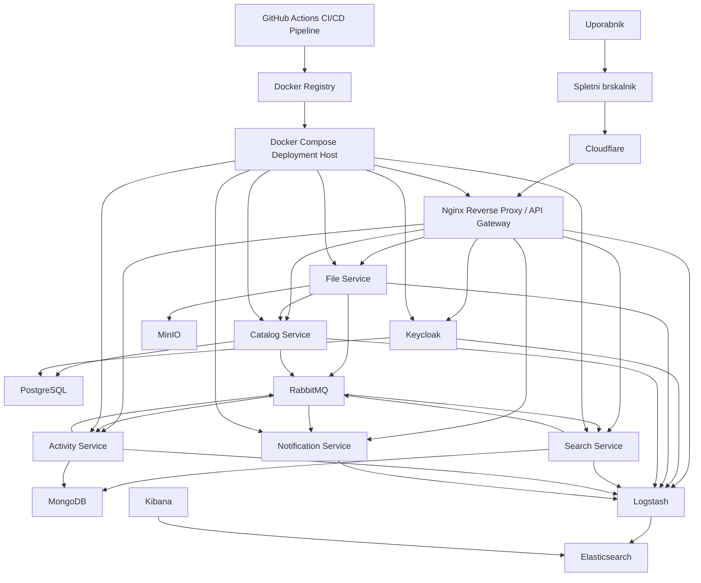

# StudyVault - formalna skica arhitekture aplikacije z ELK stackom

## Uvod

V nadaljevanju je predstavljena razsirjena formalna skica arhitekture aplikacije **StudyVault**. Dokument nadgradi osnovno arhitekturno skico z bolj podrobnim opisom infrastrukturnega sloja, varnosti, mikrostoritev, podatkovnih shramb, asinhrone komunikacije in opazovanja sistema.

Prikaz je pripravljen v dveh oblikah:

- kot tekstovna skica od zgoraj navzdol
- kot diagram v obliki `mermaid graph notation`

Pri vsaki arhitekturni stopnji je dodatno pojasnjeno:

- katera storitev je uporabljena
- zakaj je uporabljena
- kako sodeluje z ostalimi deli sistema
- katere odgovornosti prevzema v celotnem sistemu

Cilj taksne arhitekture je doseci jasno razdelitev odgovornosti, dobro varnostno zasnovo, pregledno komunikacijo med komponentami in realisticno izvedljivost v okviru projektne naloge pri predmetu NUKS.

---

## 1. Tekstovna skica arhitekture

```text
Uporabnik
    |
    v
Spletni brskalnik
    |
    v
Cloudflare
    |
    v
Nginx Reverse Proxy / API Gateway
    |
    +------------------------------------------------------------------+
    |                 |                |               |                |
    v                 v                v               v                v
Keycloak         File Service    Catalog Service   Search Service   Activity Service
    |                 |                |               |                |
    |                 |                |               |                |
    |                 v                v               v                v
    |               MinIO         PostgreSQL        MongoDB          MongoDB
    |                 |                ^               ^                ^
    |                 |                |               |                |
    +-----------------+----------------+---------------+----------------+
                      |
                      v
                 RabbitMQ
                      |
                      v
             Notification Service
                      |
                      v
             Elasticsearch + Logstash + Kibana

Izvorna koda v repozitoriju
    |
    v
GitHub Actions CI/CD Pipeline
    |
    v
Docker Registry
    |
    v
Docker Compose Deployment Host
```

---

## 2. Mermaid graph notation



---

## 3. Opis arhitekturnih stopenj

### 3.1 Uporabnik in spletni brskalnik

**Uporabljena storitev:** spletni brskalnik

**Zakaj:** spletni brskalnik predstavlja najbolj dostopen nacin uporabe aplikacije, saj uporabnik ne potrebuje posebne namestitve programske opreme.

**Kako:** uporabnik preko brskalnika dostopa do uporabniskega vmesnika, se prijavi v sistem, nalaga datoteke, pregleduje gradiva, izvaja iskanje ter spremlja zgodovino aktivnosti.

---

### 3.2 Cloudflare

**Uporabljena storitev:** `Cloudflare`

**Zakaj:** sistem potrebuje zunanjo zascitno in omrezno plast pred samim vstopom v aplikacijo. `Cloudflare` omogoca varnejso objavo aplikacije na internetu in zmanjsa obremenitev izvora.

**Kako:** `Cloudflare` v tej arhitekturi prevzame naslednje naloge:

- `DNS` upravljanje domene aplikacije
- `TLS termination` na robu omrezja
- `DDoS protection` in osnovna `WAF` pravila
- posredovanje prometa do izvornega `Nginx`
- opcijsko `Cloudflare Access` za zascito administrativnih poti
- opcijsko `geo load balancing`, ce bi bil sistem kasneje razporejen v vec regij

V osnovnem projektu se kot obvezen del uporablja `DNS`, `TLS termination`, `DDoS protection` in osnovni `WAF`. `Geo balancing` in `Cloudflare Access` sta predstavljena kot mozna razsiritev, ne kot nujni MVP funkcionalnosti.

---

### 3.3 React Frontend

**Uporabljena storitev:** `React`

**Zakaj:** React je primeren za izdelavo sodobnega in odzivnega spletnega uporabniskega vmesnika, kjer je potrebno povezati prijavo, nalaganje datotek, pregled gradiv, iskanje, oznake, mape in deljenje vsebin.

**Kako:** frontend skrbi za predstavitveni sloj aplikacije. Uporabniku prikazuje obrazce, sezname, filtre, podrobnosti o datotekah in zgodovino aktivnosti. Za avtentikacijo uporablja `OIDC Authorization Code Flow with PKCE` proti `Keycloak`, poslovne operacije pa izvaja preko klicev na backend storitve skozi `Nginx`.

---

### 3.4 Nginx Reverse Proxy / API Gateway

**Uporabljena storitev:** `Nginx`

**Zakaj:** v mikrostoritveni arhitekturi je smiselno imeti enotno vstopno tocko, ki sprejema promet od odjemalca in ga usmerja do ustrezne storitve.

**Kako:** `Nginx` sprejema vse HTTP zahtevke iz frontenda in jih na osnovi poti preusmerja:

- `/` do frontenda
- `/auth/*` do `Keycloak`
- `/api/files/*` do `File Service`
- `/api/catalog/*` do `Catalog Service`
- `/api/search/*` do `Search Service`
- `/api/activity/*` do `Activity Service`
- `/api/notifications/*` do `Notification Service`

Poleg usmerjanja prometa `Nginx` v tej arhitekturi izvaja se naslednje naloge:

- osnovni `API routing`
- `rate limiting` za prijavo, upload in iskanje
- posredovanje `Authorization` glave naprej do mikrostoritev
- centralni `access log`
- poenoteno vstopno tocko za vse odjemalce

`Nginx` v tej zasnovi ne izvaja poslovne logike in ne nadomesti sistema za identiteto, temvec deluje kot gateway in reverse proxy.

---

### 3.5 Keycloak

**Uporabljena storitev:** `Keycloak`

**Zakaj:** avtentikacija in avtorizacija sta varnostno obcutljiv del sistema. Namenski `IAM` sistem je za mikrostoritveno arhitekturo primernejsi od rocno izdelanega auth sistema, ker ze podpira `OIDC`, `JWT`, vloge, seje in centralizirano upravljanje uporabnikov.

**Kako:** `Keycloak` prevzame:

- prijavo uporabnikov
- izdajo in osvezevanje `JWT/OIDC` zetonov
- upravljanje vlog, na primer `user` in `admin`
- centralizirano identiteto in seje
- integracijo s frontendom prek `OIDC`

Mikrostoritve lokalno preverjajo veljavnost `JWT` zetonov in pravice uporabnika. `Guacamole` se v tej arhitekturi ne uporabi, ker je namenjen oddaljenemu dostopu do sistemov, ne pa identitetni platformi za spletno aplikacijo.

---

### 3.6 File Service

**Uporabljena storitev:** `File Service`

**Zakaj:** delo z dejansko vsebino datotek zahteva drugacen nacin obdelave kot delo s strukturiranimi metapodatki, zato je ta funkcionalnost locena v samostojno storitev.

**Kako:** `File Service` sprejme nalozeno datoteko, preveri njeno velikost in tip, izracuna osnovne tehnicne lastnosti in binarno vsebino shrani v `MinIO`. Po uspesnem shranjevanju objavi dogodek v `RabbitMQ` in posreduje osnovne informacije storitvi `Catalog Service`, kjer se vzpostavi uradni zapis o datoteki.

Glavne odgovornosti storitve:

- upload datotek
- download in stream datotek
- validacija datotecnih tipov
- preverjanje omejitev velikosti
- priprava povezave do objekta v `MinIO`
- objava dogodkov `file.uploaded`, `file.deleted`

---

### 3.7 Catalog Service

**Uporabljena storitev:** `Catalog Service`

**Zakaj:** aplikacija potrebuje osrednjo storitev za upravljanje vseh strukturiranih podatkov o gradivih, mapah, oznakah, priljubljenih datotekah, lastnistvu in deljenju vsebin.

**Kako:** `Catalog Service` obdeluje operacije nad metapodatki datotek. Skrbi za ustvarjanje in posodabljanje zapisov o gradivih, za povezovanje datotek z mapami in oznakami ter za hranjenje informacij o lastnistvu in dostopu. Ob spremembah objavlja dogodke, ki jih uporabljata `Search Service` in `Activity Service`.

Glavne odgovornosti storitve:

- upravljanje metapodatkov datotek
- mape in hierarhija vsebin
- oznake in priljubljene datoteke
- deljenje datotek z drugim uporabnikom
- poslovna pravila glede lastnistva in dostopa
- objava dogodkov `metadata.updated`, `share.created`

---

### 3.8 Search Service

**Uporabljena storitev:** `Search Service`

**Zakaj:** iskanje po gradivih je smiselno lociti od osnovnega CRUD dela aplikacije, saj gre za drugacen tip poizvedb in optimizacije.

**Kako:** `Search Service` pripravlja in uporablja denormaliziran iskalni pogled nad gradivi. Ob dogodkih iz `RabbitMQ` posodablja dokumente v `MongoDB`, nato pa omogoca hitro iskanje po naslovu, oznakah, tipu datoteke, datumu, lastniku ali mapi.

Glavne odgovornosti storitve:

- osnovno in napredno iskanje
- filtriranje po metapodatkih
- polnjenje in osvezevanje iskalnega pogleda
- reindeksacija posamezne datoteke ali vseh datotek

---

### 3.9 Activity Service

**Uporabljena storitev:** `Activity Service`

**Zakaj:** aplikacija potrebuje pregled nad pomembnimi dejanji uporabnikov, tako zaradi uporabniske funkcionalnosti kot tudi zaradi osnovnega audita sistema.

**Kako:** `Activity Service` hrani dogodke, kot so prijava, nalaganje datotek, brisanje, prenos, deljenje in spremembe metapodatkov. Dogodke prejema iz asinhronega toka prek `RabbitMQ` ali preko internega API klica. Frontend lahko nato prikaze uporabniku zadnje aktivnosti.

Glavne odgovornosti storitve:

- belezenje uporabniskih dogodkov
- prikaz `recent activity`
- osnovni audit pomembnih operacij
- pripis dogodkov uporabniku in datoteki

---

### 3.10 Notification Service

**Uporabljena storitev:** `Notification Service`

**Zakaj:** ce sistem ze uporablja event broker, je smiselno dodati lahko podporno storitev, ki iz dogodkov pripravlja uporabniska obvestila brez dodatne obremenitve jedrnih storitev.

**Kako:** `Notification Service` poslusa dogodke v `RabbitMQ` in jih pretvarja v sistemska obvestila, na primer:

- datoteka uspesno nalozena
- datoteka deljena z uporabnikom
- pripravljena predogledna vsebina
- neuspesna obdelava datoteke

Ta storitev ni nujna za najosnovnejsi MVP, je pa koristna za prikaz dodatne vrednosti mikrostoritvene arhitekture.

---

### 3.11 PostgreSQL

**Uporabljena storitev:** `PostgreSQL`

**Zakaj:** relacijska baza je primerna za urejene, med seboj povezane in transakcijsko pomembne podatke.

**Kako:** v `PostgreSQL` se shranjujejo predvsem strukturirani poslovni podatki:

- zapisi o datotekah
- mape
- oznake
- relacije med datotekami in oznakami
- favorite
- pravice deljenja
- aplikacijski uporabniski profilni podatki
- identifikatorji uporabnikov iz `Keycloak`

To bazo uporablja predvsem `Catalog Service`, delno pa tudi `Keycloak` in morebitni profilni del sistema.

---

### 3.12 MongoDB

**Uporabljena storitev:** `MongoDB`

**Zakaj:** za dnevnike aktivnosti in iskalne dokumente je primerna bolj fleksibilna `NoSQL` baza, kjer ni nujna stroga relacijska struktura.

**Kako:** `MongoDB` v tej arhitekturi hrani:

- iskalne dokumente za `Search Service`
- activity feed za `Activity Service`
- morebitne tekstovne izvlecke ali denormalizirane poglede za hitre poizvedbe

S tem se zmanjsa obremenitev transakcijskega `PostgreSQL` sloja.

---

### 3.13 MinIO

**Uporabljena storitev:** `MinIO`

**Zakaj:** dejanska vsebina datotek ne sodi v relacijsko bazo, temvec v objektno shrambo, ki je bolj primerna za vecje binarne podatke.

**Kako:** `MinIO` hrani:

- PDF datoteke
- slike
- zapiske
- projektne dokumente
- generirane predoglede in srodne datotecne artefakte

`File Service` vanj zapisuje in iz njega bere vsebino datotek, medtem ko se v podatkovnih bazah hranijo samo reference in pripadajoci metapodatki.

---

### 3.14 RabbitMQ

**Uporabljena storitev:** `RabbitMQ`

**Zakaj:** mikrostoritvena arhitektura potrebuje asinhroni komunikacijski kanal za dogodke, ki ne sodijo v sinhrone uporabniske zahteve. `RabbitMQ` je primeren za studentski projekt, ker je lazji za razumevanje in zagon kot `Kafka`.

**Kako:** `RabbitMQ` se uporablja za prenos dogodkov med storitvami. Primeri dogodkov:

- `file.uploaded`
- `file.deleted`
- `metadata.updated`
- `share.created`
- `activity.created`
- `index.requested`

Tak pristop zmanjsa neposredno odvisnost med storitvami in omogoca bolj pregledno razsirjanje sistema.

---

### 3.15 ELK stack

**Uporabljena storitev:** `Elasticsearch + Logstash + Kibana`

**Zakaj:** ker sistem vsebuje vec storitev, je za spremljanje delovanja in iskanje napak potrebna centralizirana obdelava logov. `ELK` je primeren za strukturirano belezenje, iskanje po logih in izdelavo pregledov delovanja sistema.

**Kako:** posamezne storitve, `Nginx` in po potrebi tudi `Keycloak` posiljajo strukturirane `JSON` log zapise v `Logstash`. `Logstash` loge obdela, standardizira in shrani v `Elasticsearch`. `Kibana` nato omogoca pregled logov, filtriranje, iskanje napak in pripravo preprostih nadzornih plosc.

`ELK stack` v tej arhitekturi prevzema:

- centralizirano zbiranje logov
- iskanje po napakah in dogodkih
- osnovno opazovanje aplikacije
- pomoc pri odpravljanju tezav in predstavitvi delovanja projekta

---

### 3.16 CI/CD Pipeline

**Uporabljena storitev:** `GitHub Actions`

**Zakaj:** projekt vsebuje vec komponent, ki jih je smiselno preveriti, zgraditi in pripraviti za objavo na poenoten nacin. `CI/CD` zmanjsa rocno delo, zmanjsa moznost napak pri dostavi in omogoca bolj pregledno demonstracijo celotnega razvojnega procesa.

**Kako:** `GitHub Actions` se sprozi ob `pull request` in ob `push` na glavno vejo. V validacijskem delu izvede osnovne korake, kot so preverjanje kode, poganjanje testov in build frontenda. Nato lahko zgradi `Docker` slike za frontend, `Nginx` in posamezne mikrostoritve, jih objavi v `Docker Registry` ter na ciljnem `Docker Compose` hostu sprozi posodobitev storitev. Tako `CI/CD` ne sodeluje v uporabniskem request flowu, ampak skrbi za zanesljivo pripravo in dostavo runtime okolja.

Glavne odgovornosti storitve:

- sprozanje pipeline ob `push` in `pull request`
- avtomatizirano preverjanje kode in testov
- build frontenda in mikrostoritev
- gradnja `Docker` slik
- objava slik v `Docker Registry`
- avtomatizirana dostava na `Docker Compose` host
- priprava ponovljivega postopka za demo in produkcijsko namestitev

---

## 4. Razmejitev odgovornosti po komponentah

### 4.1 Kaj uporablja Cloudflare

V projektu se iz `Cloudflare` uporabljajo naslednje funkcije:

- `DNS` za domeno aplikacije
- `TLS termination`
- `DDoS protection`
- osnovni `WAF`

Kot razsiritev sta omenjena:

- `Cloudflare Access` za zascito administratorskih poti
- `geo balancing` za vec-regijsko prihodnjo postavitev

Primarna uporabniska avtentikacija ne poteka prek `Cloudflare`, ampak prek `Keycloak`.

---

### 4.2 Kaj uporablja Nginx

`Nginx` v sistemu izvaja:

- serviranje frontenda
- usmerjanje API zahtevkov
- `rate limiting`
- posredovanje identitetnih glav
- zapisovanje centralnih access logov

`Nginx` ne hrani poslovnih podatkov in ne vodi uporabniskih sej.

---

### 4.3 Kateri programski jezik uporabljajo mikrostoritve

Vse lastne mikrostoritve v tej arhitekturi uporabljajo:

- `Python`
- ogrodje `FastAPI`

Razlogi:

- poenotena implementacija
- hitra izdelava `REST` API
- dobra podpora za validacijo podatkov
- samodejna `OpenAPI` dokumentacija
- primerna zahtevnost za projektno nalogo

`Node.js` in `PHP` se v tej arhitekturi ne uporabita kot primarna implementacijska izbira.

---

### 4.4 Katera identitetna knjiznica ali platforma se uporabi

Uporabi se:

- `Keycloak`

Ne uporabi se:

- `Guacamole`

Razlog:

- `Keycloak` je identitetna platforma za `OIDC`, `JWT`, uporabnike, vloge in seje
- `Guacamole` je namenjen oddaljenemu dostopu do namizij in streznikov, ne pa uporabniskemu auth sistemu spletne aplikacije

---

### 4.5 Kateri event queue se uporabi

Uporabi se:

- `RabbitMQ`

Ne uporabi se kot primarna izbira:

- `Kafka`, ker je operativno tezja za manjsi projekt
- `ML`, ker ne predstavlja queue tehnologije

---

### 4.6 Kateri podatki gredo v PostgreSQL

V `PostgreSQL` se hranijo:

- identiteta aplikacijskega uporabnika in povezava na `Keycloak user id`
- datoteka kot poslovni zapis
- ime datoteke
- mime type
- velikost
- status datoteke
- mapa
- oznake
- priljubljene datoteke
- deljenje datotek
- lastnistvo
- cas ustvarjanja in posodobitve

To so strukturirani in relacijsko pomembni podatki, zato sodijo v relacijsko bazo.

---

### 4.7 Kateri podatki gredo v MongoDB

V `MongoDB` se hranijo:

- iskalni dokumenti
- activity feed
- denormalizirani pregledi za hitro poizvedovanje
- morebitni tekstovni izvlecki za iskanje in filtriranje

To so fleksibilni dokumentni zapisi, ki jih je smiselno hraniti izven glavnega transakcijskega sistema.

---

### 4.8 Kaj izvaja CI/CD pipeline

`CI/CD pipeline` v sistemu izvaja:

- avtomatizirano preverjanje sprememb ob `pull request`
- build frontenda in backend storitev
- gradnjo in oznacevanje `Docker` slik
- objavo slik v `Docker Registry`
- posodobitev ciljnega `Docker Compose` okolja po uspesnem buildu

`CI/CD pipeline` ne izvaja:

- poslovne logike aplikacije
- avtentikacije uporabnikov
- runtime usmerjanja prometa
- shranjevanja datotek ali metapodatkov

Njegova naloga je avtomatizirati prehod od spremembe v repozitoriju do posodobljene zagnane verzije sistema.

---

## 5. Potek zahtevkov skozi sistem

### 5.1 Prijava uporabnika

1. Uporabnik odpre aplikacijo v brskalniku.
2. Zahteva potuje prek `Cloudflare` do `Nginx`.
3. Frontend preusmeri uporabnika na prijavo v `Keycloak`.
4. `Keycloak` izvede prijavo in vrne `OIDC` tokene.
5. Frontend nato klice zascitene API poti prek `Nginx`.
6. Mikrostoritve preverijo `JWT` in uporabniske vloge.

---

### 5.2 Nalaganje datoteke

1. Uporabnik izbere datoteko.
2. Frontend poslje `POST /api/files`.
3. `Nginx` zahtevo preusmeri v `File Service`.
4. `File Service` preveri tip in velikost datoteke.
5. Datoteka se shrani v `MinIO`.
6. `File Service` poslje metapodatke v `Catalog Service`.
7. Objavi se dogodek `file.uploaded` v `RabbitMQ`.
8. `Activity Service` in `Search Service` posodobita svoj pogled.
9. Vse storitve zapisujejo loge v `ELK`.

---

### 5.3 Iskanje po gradivih

1. Uporabnik vnese iskalni niz.
2. Frontend poklice `GET /api/search`.
3. `Search Service` izvede poizvedbo nad iskalnimi dokumenti v `MongoDB`.
4. Rezultati se vrnejo preko `Nginx` nazaj v frontend.

---

### 5.4 Deljenje datoteke

1. Uporabnik izbere datoteko in prejemnika.
2. Frontend poklice `POST /api/catalog/files/{fileId}/share`.
3. `Catalog Service` preveri pravice in ustvari zapis o deljenju v `PostgreSQL`.
4. Objavi se dogodek `share.created`.
5. `Notification Service` pripravi obvestilo za ciljnega uporabnika.
6. `Activity Service` zabelezi dogodek v feed.

---

### 5.5 Belezenje aktivnosti

1. Uporabnik izvede operacijo, na primer upload, delete ali download.
2. Izvorna storitev objavi dogodek v `RabbitMQ` ali poklice interni activity endpoint.
3. `Activity Service` shrani zapis v `MongoDB`.
4. Frontend lahko preko `GET /api/activity/me` prikaze zadnje dogodke.

---

### 5.6 Potek CI/CD dostave

1. Razvijalec potisne spremembo v repozitorij ali odpre `pull request`.
2. `GitHub Actions` zazna dogodek in sprozi ustrezen workflow.
3. Pipeline izvede korake za preverjanje kode, testiranje in build frontenda.
4. Ob `push` na glavno vejo se zgradijo `Docker` slike za frontend, `Nginx` in mikrostoritve.
5. Zgrajene slike se objavijo v `Docker Registry`.
6. Na ciljnem `Docker Compose` hostu se sprozi posodobitev storitev.
7. Posodobljeni vsebniki se ponovno zazenejo in nova verzija sistema postane dosegljiva prek `Nginx`.

---

## 6. Formalna REST API deklaracija

V nadaljevanju je podan predlagan formalni pregled `REST` vmesnikov. Namen deklaracije je opredeliti glavne poti, njihovo odgovornost ter pricakovano uporabo v sistemu.

### 6.1 Auth in identiteta

Ker avtentikacijo vodi `Keycloak`, aplikacija uporablja njegove `OIDC` endpoint-e, dodatno pa ima lahko poenostavljen aplikacijski auth prehod.

| Endpoint | Metoda | Namen | Avtentikacija |
|---|---|---|---|
| `/auth/login` | `GET` | preusmeritev na `Keycloak` prijavo | ne |
| `/auth/logout` | `POST` | odjava uporabnika in koncanje seje | da |
| `/auth/me` | `GET` | vrne osnovni profil trenutnega uporabnika | da |
| `/auth/roles` | `GET` | vrne seznam vlog uporabnika | da |

Tipicni statusi:

- `200 OK`
- `302 Found`
- `401 Unauthorized`
- `403 Forbidden`

---

### 6.2 File Service API

| Endpoint | Metoda | Namen | Avtentikacija |
|---|---|---|---|
| `/api/files` | `POST` | upload nove datoteke | da |
| `/api/files/{fileId}` | `GET` | vrne podrobnosti o shranjeni datoteki | da |
| `/api/files/{fileId}/download` | `GET` | download datoteke | da |
| `/api/files/{fileId}/stream` | `GET` | stream ali predogled datoteke | da |
| `/api/files/{fileId}` | `DELETE` | logicni izbris datoteke | da |
| `/api/files/{fileId}/restore` | `POST` | obnovitev logicno izbrisane datoteke | da |
| `/api/files/{fileId}/presign` | `GET` | vrne casovno omejeno povezavo za objekt | da |

Opis:

- `POST /api/files` sprejme datoteko in dodatne parametre, kot so mapa, oznake ali vidnost
- `GET /api/files/{fileId}` vrne tehnicne in sistemske podatke o datoteki
- `DELETE /api/files/{fileId}` pomeni odstranjevanje vsebine iz `MinIO` in oznacitev zapisa kot izbrisanega

Tipicni statusi:

- `200 OK`
- `201 Created`
- `400 Bad Request`
- `401 Unauthorized`
- `403 Forbidden`
- `404 Not Found`
- `409 Conflict`
- `500 Internal Server Error`

---

### 6.3 Catalog Service API

| Endpoint | Metoda | Namen | Avtentikacija |
|---|---|---|---|
| `/api/catalog/files` | `GET` | seznam datotek uporabnika | da |
| `/api/catalog/files/{fileId}` | `GET` | podrobnosti datoteke iz kataloga | da |
| `/api/catalog/files/{fileId}` | `PATCH` | posodobitev imena, mape ali atributov | da |
| `/api/catalog/folders` | `POST` | ustvarjanje mape | da |
| `/api/catalog/folders` | `GET` | seznam map | da |
| `/api/catalog/folders/{folderId}` | `PATCH` | preimenovanje ali premik mape | da |
| `/api/catalog/folders/{folderId}` | `DELETE` | brisanje mape | da |
| `/api/catalog/files/{fileId}/tags` | `POST` | dodajanje oznak | da |
| `/api/catalog/files/{fileId}/tags/{tagId}` | `DELETE` | odstranitev oznake | da |
| `/api/catalog/files/{fileId}/favorite` | `POST` | oznaci datoteko kot priljubljeno | da |
| `/api/catalog/files/{fileId}/favorite` | `DELETE` | odstrani iz priljubljenih | da |
| `/api/catalog/files/{fileId}/share` | `POST` | deljenje datoteke z drugim uporabnikom | da |
| `/api/catalog/files/{fileId}/share/{userId}` | `DELETE` | preklic deljenja | da |

Tipicni statusi:

- `200 OK`
- `201 Created`
- `400 Bad Request`
- `401 Unauthorized`
- `403 Forbidden`
- `404 Not Found`
- `409 Conflict`

---

### 6.4 Search Service API

| Endpoint | Metoda | Namen | Avtentikacija |
|---|---|---|---|
| `/api/search` | `GET` | osnovno iskanje po nizu in filtrih | da |
| `/api/search/advanced` | `GET` | napredno iskanje po vec kriterijih | da |
| `/api/search/reindex/{fileId}` | `POST` | ponovno indeksiranje posamezne datoteke | da, admin |
| `/api/search/reindex-all` | `POST` | ponovno indeksiranje celotnega iskalnega pogleda | da, admin |

Mozni filtri:

- `q`
- `tag`
- `type`
- `owner`
- `folder`
- `dateFrom`
- `dateTo`
- `favorite`

Tipicni statusi:

- `200 OK`
- `400 Bad Request`
- `401 Unauthorized`
- `403 Forbidden`

---

### 6.5 Activity Service API

| Endpoint | Metoda | Namen | Avtentikacija |
|---|---|---|---|
| `/api/activity` | `GET` | vrne activity feed glede na filtre | da |
| `/api/activity/me` | `GET` | vrne aktivnosti trenutnega uporabnika | da |
| `/api/activity/files/{fileId}` | `GET` | vrne aktivnosti povezane z datoteko | da |
| `/api/activity/events` | `POST` | interni vnos dogodka v activity sloj | interni |

Tipicni statusi:

- `200 OK`
- `201 Created`
- `401 Unauthorized`
- `403 Forbidden`
- `404 Not Found`

---

### 6.6 Notification Service API

| Endpoint | Metoda | Namen | Avtentikacija |
|---|---|---|---|
| `/api/notifications` | `GET` | seznam uporabniskih obvestil | da |
| `/api/notifications/{notificationId}/read` | `PATCH` | oznaci obvestilo kot prebrano | da |
| `/api/notifications/test` | `POST` | interni testni vnos obvestila | da, admin |

Tipicni statusi:

- `200 OK`
- `201 Created`
- `401 Unauthorized`
- `403 Forbidden`
- `404 Not Found`

---

## 7. Seznam storitev za docker-compose

Za lokalni zagon projekta v `docker-compose` morajo biti predvidene naslednje storitve:

- `frontend`
- `nginx`
- `keycloak`
- `file-service`
- `catalog-service`
- `search-service`
- `activity-service`
- `notification-service`
- `postgres`
- `mongodb`
- `minio`
- `rabbitmq`
- `elasticsearch`
- `logstash`
- `kibana`

V produkcijskem okolju je pred temi storitvami se zunanji `Cloudflare`, ki pa ni del lokalnega `docker-compose` zagona.

`GitHub Actions CI/CD Pipeline` ni del lokalnega `docker-compose` seznama, ker predstavlja zunanji avtomatizacijski sloj, ki storitve preveri, zgradi in dostavi v ciljno okolje.

---

## 8. Zakljucna arhitekturna logika

Predlagana arhitektura aplikacije **StudyVault** temelji na jasni razdelitvi odgovornosti med robni varnostni sloj, gateway sloj, identitetni sloj, poslovne mikrostoritve, asinhrono komunikacijo, podatkovni sloj in opazovalni sloj.

Glavna logika sistema je naslednja:

- `Cloudflare` varuje in terminira javni promet
- `Nginx` usmerja promet do pravilnih storitev in izvaja osnovne gateway funkcije
- `Keycloak` skrbi za avtentikacijo in avtorizacijo
- `Python/FastAPI` mikrostoritve izvajajo poslovno logiko
- `RabbitMQ` povezuje storitve z asinhronimi dogodki
- `PostgreSQL`, `MongoDB` in `MinIO` hranijo razlicne tipe podatkov po nacelu prave shrambe za pravi namen
- `ELK stack` skrbi za centralizirano belezenje in opazovanje delovanja sistema
- `GitHub Actions` avtomatizira preverjanje, build in dostavo sistema proti `Docker Compose` okolju

Taksna zasnova je dovolj obsezna, moderna in argumentirana za projekt pri predmetu NUKS, hkrati pa se vedno dovolj realisticna, da jo je mogoce predstaviti in postopno implementirati z `Docker Compose`.
