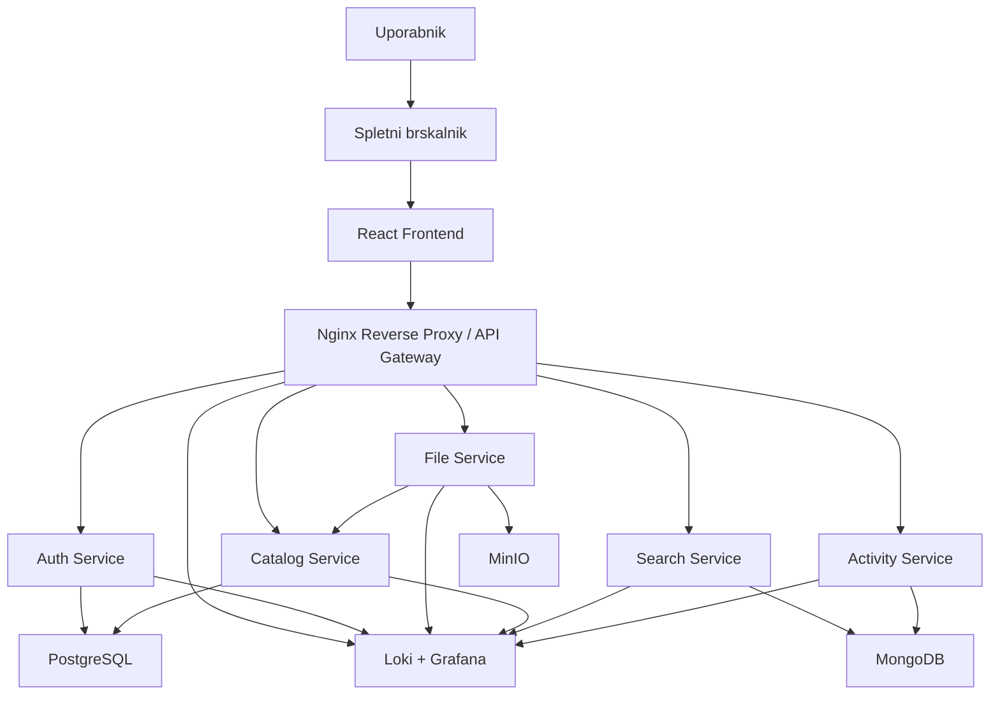

# NUKS projekt

## Skica arhitekture aplikacije StudyVault

### Predmet

Napredni uporabniski in komunikacijski sistemi

### Projekt

StudyVault

### Opis

V tem dokumentu je predstavljena skica arhitekture aplikacije **StudyVault**. Namen dokumenta je prikazati osnovno razdelitev sistema na posamezne komponente, opisati njihovo vlogo ter pojasniti medsebojno komunikacijo med deli aplikacije. Arhitektura je prikazana v tekstovni obliki in z diagramom `mermaid`, nato pa je za vsako stopnjo podana kratka razlaga uporabljene storitve, razloga za njeno uporabo in nacina delovanja.

---

## 1. Tekstovna skica arhitekture

```text
Uporabnik
    |
    v
Spletni brskalnik
    |
    v
React Frontend
    |
    v
Nginx Reverse Proxy / API Gateway
    |
    +---------------------------------------------------+
    |                  |               |                |
    v                  v               v                v
Auth Service      File Service    Catalog Service   Search Service
    |                  |               |                |
    v                  v               v                v
PostgreSQL          MinIO         PostgreSQL         MongoDB
                       |
                       v
                 Activity Service
                       |
                       v
                    MongoDB
                       |
                       v
                 Loki + Grafana
```

---

## 2. Mermaid diagram



---

## 3. Razlaga arhitekture po stopnjah

### 3.1 Uporabnik in spletni brskalnik

**Katera storitev je uporabljena:** spletni brskalnik

**Zakaj je uporabljena:** uporabnik mora imeti enostaven dostop do sistema brez dodatne namestitve. Spletni brskalnik je zato najbolj primerna in najbolj dostopna vstopna tocka.

**Kako deluje:** uporabnik preko brskalnika dostopa do aplikacije, se prijavi, nalaga studijska gradiva, pregleduje svoje datoteke in izvaja iskanje.

---

### 3.2 React Frontend

**Katera storitev je uporabljena:** `React`

**Zakaj je uporabljena:** React omogoca izdelavo sodobnega, preglednega in odzivnega uporabniskega vmesnika, kar je pomembno pri aplikaciji za upravljanje studijskih gradiv.

**Kako deluje:** frontend predstavlja uporabniski sloj sistema. Prikazuje prijavo, seznam datotek, podrobnosti o gradivih, obrazce za nalaganje in rezultate iskanja. Podatke pridobiva z zahtevki na backend storitve preko `Nginx`.

---

### 3.3 Nginx Reverse Proxy / API Gateway

**Katera storitev je uporabljena:** `Nginx`

**Zakaj je uporabljena:** sistem vsebuje vec storitev, zato potrebujemo enotno vstopno tocko, ki promet sprejme in ga usmeri na pravilno komponento.

**Kako deluje:** `Nginx` sprejme vse zahtevke iz frontenda ter jih preusmeri glede na pot URL:

- `/` na frontend
- `/api/auth` na `Auth Service`
- `/api/files` na `File Service`
- `/api/catalog` na `Catalog Service`
- `/api/search` na `Search Service`
- `/api/activity` na `Activity Service`

Tako se ohrani pregledna in centralizirana komunikacija med odjemalcem in mikrostoritvami.

---

### 3.4 Auth Service

**Katera storitev je uporabljena:** `Auth Service`

**Zakaj je uporabljena:** avtentikacija uporabnikov je varnostno pomemben del sistema in mora biti jasno locena od ostale poslovne logike.

**Kako deluje:** storitev skrbi za registracijo uporabnikov, prijavo, preverjanje identitete in izdajo `JWT` zetonov. Druge storitve nato s pomocjo teh zetonov ugotavljajo, ali ima uporabnik pravico do dostopa ali spremembe podatkov.

---

### 3.5 File Service

**Katera storitev je uporabljena:** `File Service`

**Zakaj je uporabljena:** shranjevanje in prenos dejanske vsebine datotek je samostojen problem, ki ga ni smiselno mesati z upravljanjem metapodatkov.

**Kako deluje:** storitev sprejme nalozeno datoteko, preveri njene osnovne lastnosti in jo shrani v objektno shrambo `MinIO`. Nato posreduje osnovne podatke o datoteki storitvi `Catalog Service`, kjer se zabelezijo metapodatki.

---

### 3.6 Catalog Service

**Katera storitev je uporabljena:** `Catalog Service`

**Zakaj je uporabljena:** za aplikacijo je kljucno, da ima urejen in centraliziran pregled nad vsemi podatki o gradivih, mapah, oznakah in lastnistvu.

**Kako deluje:** `Catalog Service` hrani in upravlja metapodatke datotek. Skrbi za ustvarjanje zapisov, posodabljanje imen datotek, povezovanje gradiv z mapami in oznakami ter za upravljanje dostopnih pravil.

---

### 3.7 Search Service

**Katera storitev je uporabljena:** `Search Service`

**Zakaj je uporabljena:** iskanje po datotekah in oznakah zahteva drugacen nacin poizvedovanja kot klasicne relacijske operacije nad podatki.

**Kako deluje:** storitev gradi in uporablja iskalni indeks, s katerim omogoca hitro iskanje po naslovu, oznakah, tipu datoteke in drugih atributih. Na ta nacin iskalne operacije ne obremenjujejo glavne relacijske baze.

---

### 3.8 Activity Service

**Katera storitev je uporabljena:** `Activity Service`

**Zakaj je uporabljena:** sistem potrebuje vpogled v nedavne aktivnosti uporabnikov, hkrati pa taka evidenca pomaga tudi pri spremljanju delovanja aplikacije.

**Kako deluje:** storitev belezi dogodke, kot so prijava, nalaganje, brisanje, prenos in urejanje datotek. Ti dogodki se nato lahko prikazejo v uporabniskem vmesniku kot zgodovina aktivnosti.

---

### 3.9 PostgreSQL

**Katera storitev je uporabljena:** `PostgreSQL`

**Zakaj je uporabljena:** relacijska baza je najbolj primerna za strukturirane, povezane in transakcijsko pomembne podatke.

**Kako deluje:** `PostgreSQL` hrani uporabnike, datoteke, mape, oznake in povezave med njimi. Uporabljata jo predvsem `Auth Service` in `Catalog Service`.

---

### 3.10 MongoDB

**Katera storitev je uporabljena:** `MongoDB`

**Zakaj je uporabljena:** dokumentna baza je primerna za bolj fleksibilne podatkovne strukture, kot so dnevniki dogodkov in iskalni dokumenti.

**Kako deluje:** `Search Service` uporablja `MongoDB` za hranjenje iskalnega pogleda nad gradivi, `Activity Service` pa za hranjenje zapisov o uporabniskih dogodkih.

---

### 3.11 MinIO

**Katera storitev je uporabljena:** `MinIO`

**Zakaj je uporabljena:** objektna shramba je primernejsa za hranjenje binarnih datotek kot klasicna relacijska baza.

**Kako deluje:** `MinIO` hrani dejansko vsebino datotek, kot so PDF dokumenti, slike in zapiski. `File Service` datoteke vanj zapisuje in jih iz njega tudi bere ob zahtevi za prenos.

---

### 3.12 Loki + Grafana

**Katera storitev je uporabljena:** `Loki + Grafana`

**Zakaj je uporabljena:** pri sistemu z vec storitvami je centralno spremljanje logov nujno za lazje odkrivanje napak in spremljanje delovanja sistema.

**Kako deluje:** vse storitve in `Nginx` posiljajo dnevnike v `Loki`, kjer se zbirajo. `Grafana` nato omogoca pregled teh podatkov v obliki nadzornih plosc in iskalnih pogledov.

---

## 4. Zakljucek

Predlagana arhitektura aplikacije **StudyVault** je zasnovana kot pregledna mikrostoritvena arhitektura, pri kateri ima vsaka komponenta jasno doloceno nalogo. Tak pristop omogoca boljso modularnost, lazje razumevanje sistema in primeren tehnicni obseg za projekt pri predmetu NUKS. Arhitektura je hkrati dovolj kompleksna, da prikazuje uporabo sodobnih konceptov, vendar se vedno dovolj enostavna, da ostaja realno izvedljiva v okviru studentskega projekta.
